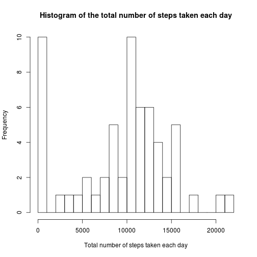
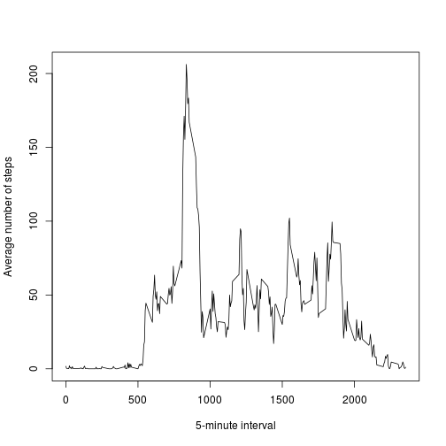
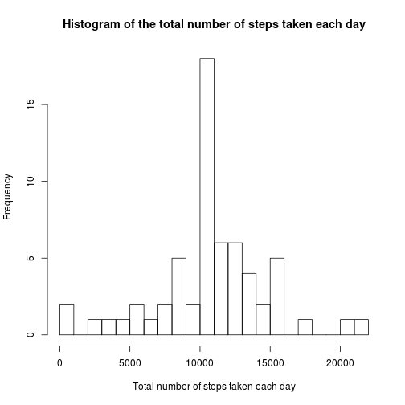
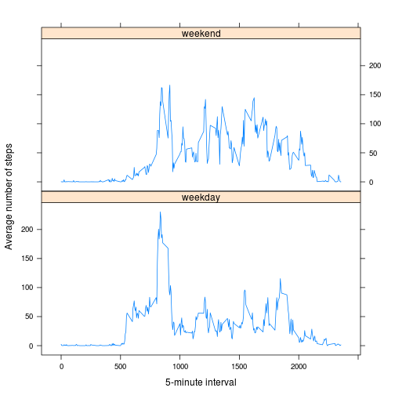

## Loading and preprocessing the data

### Load the data

Assume that the data is in the current working directory.

Unzip the archive if necessary:

```r
unzip("activity.zip", overwrite = FALSE)
```

```
## Warning in unzip("activity.zip", overwrite = FALSE): not overwriting file
## './activity.csv
```

Load the data:

```r
df <- read.csv("activity.csv")
```

### Look at the structure of the data

```r
str(df)
```

```
## 'data.frame':	17568 obs. of  3 variables:
##  $ steps   : int  NA NA NA NA NA NA NA NA NA NA ...
##  $ date    : Factor w/ 61 levels "2012-10-01","2012-10-02",..: 1 1 1 1 1 1 1 1 1 1 ...
##  $ interval: int  0 5 10 15 20 25 30 35 40 45 ...
```

```r
head(df)
```

```
##   steps       date interval
## 1    NA 2012-10-01        0
## 2    NA 2012-10-01        5
## 3    NA 2012-10-01       10
## 4    NA 2012-10-01       15
## 5    NA 2012-10-01       20
## 6    NA 2012-10-01       25
```

```r
tail(df)
```

```
##       steps       date interval
## 17563    NA 2012-11-30     2330
## 17564    NA 2012-11-30     2335
## 17565    NA 2012-11-30     2340
## 17566    NA 2012-11-30     2345
## 17567    NA 2012-11-30     2350
## 17568    NA 2012-11-30     2355
```

### Preprocess the data

Convert the dates and times:

```r
library(lubridate)
# times might have been useful for imputing missing values
# but it wasn't needed so I have commented out this block of code
#df$time <- sprintf("%04d", df$interval)
#df$date_time <- paste(df$date, df$time, sep="-")
#df$date_time <- ymd_hm(df$date_time)

# convert the dates
df$date <- ymd(df$date)
```


## What is mean total number of steps taken per day?

Make a histogram of the total number of steps taken each day:

```r
library(plyr)
```

```
## 
## Attaching package: 'plyr'
## 
## The following object is masked from 'package:lubridate':
## 
##     here
```

```r
# Create a new data frame containing the averages
sdf <- ddply(df, c("date"), summarize, total = sum(steps, na.rm = TRUE))

# Plot the histogram
hist(sdf$total, breaks=20, main = "Histogram of the total number of steps taken each day", xlab="Total number of steps taken each day")
```

 

Calculate the mean and median total number of steps per day:

```r
mean(sdf$total)
```

```
## [1] 9354.23
```

```r
median(sdf$total)
```

```
## [1] 10395
```

## What is the average daily activity pattern?

Make a time series plot of the 5-minute interval (x-axis) and the average number of steps taken, averaged across all days (y-axis):


```r
# Create a new data frame containing the averages
tdf <- ddply(df, c("interval"), summarize, avg = mean(steps, na.rm = TRUE))

# Plot the time series
plot(tdf$interval, tdf$avg, type="l", xlab="5-minute interval", ylab="Average number of steps")
```

 

Which 5-minute interval, on average across all the days in the dataset, contains the maximum number of steps?

```r
# display the row, to compare against the plot (for sanity checking)
tdf[tdf$avg==max(tdf$avg),] 
```

```
##     interval      avg
## 104      835 206.1698
```

```r
# store the value in a variable to insert into the text below
max_interval <- tdf[tdf$avg==max(tdf$avg),]$interval 
```

The interval that contains the maximum number of steps on average is 835. This seems reasonable because people are often very active at this time in the morning.

## Imputing missing values

Calculate the total number of missing values in the dataset:

```r
num_missing_values <- sum(is.na(df$steps))
```
The total number of missing values is 2304.

### Investigating the missing values

For interest, the fraction of missing values is:

```r
sum(is.na(df$steps)) / nrow(df)
```

```
## [1] 0.1311475
```

Let's look at the distribution of missing values, by day:

```r
ddf <- ddply(df, c("date"), summarize, num_na = sum(is.na(steps)))

# store the number of days for future use:
num_days <- nrow(ddf)

plot(ddf$date, ddf$num_na, xlab="date", ylab="Number of missing values", main="Number of missing values for each day")
```

 

Each day has 288 intervals (24 hours x 12 intervals per hour). How many days had NA values for the whole day?

```r
missing_days <- ddf[ddf$num_na == 288,]$date
num_missing_days <- length(missing_days)
```
The number of days where all steps are NA is 8.

Check that this accounts for all missing values for the steps - it does if the remainder is 0:

```r
num_missing_values - num_missing_days * 288
```

```
## [1] 0
```

### Strategy for filling in the missing values

Replacing missing values with an average for that day is probably not appropriate because the average values are unknown (since all values for days with missing values are unknown).

Given that we might expect a variation between weekdays and weekends a good strategy might be to use the mean for the 5-minute interval for that day of the week. (This is more sophisticated than just the mean for that 5-minute interval.)

Let's look at what days the missing values were on.

```r
weekdays(missing_days)
```

```
## [1] "Monday"    "Monday"    "Thursday"  "Sunday"    "Friday"    "Saturday" 
## [7] "Wednesday" "Friday"
```

The missing days are spread across the week - 6 weekdays and 2 weekend days.

For now, though (since time is limited), let's just use the mean for that 5-minute interval when filling in missing values.

### Fill in the missing values


```r
# make a copy of the original dataset
fdf <- df

# Fill in the missing values with the mean value for that 5-minute interval
fdf$steps <- ifelse(is.na(fdf$steps), tdf$avg, fdf$steps)

# check that we have filled them all in (the result should be 0)
sum(is.na(fdf$steps))
```

```
## [1] 0
```

Plot a histogram of the total number of steps taken per day:

```r
# Create a new data frame containing the averages
sfdf <- ddply(fdf, c("date"), summarize, total = sum(steps))

# Make the histogram
hist(sfdf$total, breaks=20, main = "Histogram of the total number of steps taken each day", xlab="Total number of steps taken each day")
```

 

Calculate the mean and median total number of steps per day:

```r
mean(sfdf$total)
```

```
## [1] 10766.19
```

```r
median(sfdf$total)
```

```
## [1] 10766.19
```

The mean and median have both now increased. The median and mean are now the same value. Imputing missing values has increased these values because when we did the initial analysis we did not take account of the fact that the missing values were all on 8 days.

Looking at the original data again:


```r
# original mean
sum(sdf$total) / num_days
```

```
## [1] 9354.23
```

```r
# mean when ignoring the missing days
sum(sdf$total) / (num_days - num_missing_days)
```

```
## [1] 10766.19
```

The new mean is the same as the value we would have got if we had removed the missing days. Following imputation, the 8 missing days now have a total number of steps equal to this new mean value and therefore it is not surprising that the new median total number of steps is the same as the new mean value.


## Are there differences in activity patterns between weekdays and weekends?

Create a new factor variable in the dataset with two levels -- "weekday" and "weekend" indicating whether a given date is a weekday or weekend day:


```r
fdf$day_type <- as.factor(ifelse(weekdays(fdf$date) %in% c("Saturday", "Sunday"), "weekend", "weekday"))
```

Make a panel plot containing a time series plot of the 5-minute interval (x-axis) and the average number of steps taken, averaged across all weekday days or weekend days (y-axis):


```r
# Create two new data frames for the weekday and weekend averages
# and the bind them into a single data frame for plotting.
# I'm sure there is a more elegant way of doing this!
tfdf_weekday <- ddply(fdf[fdf$day_type == "weekday", ], c("interval"), summarize, avg = mean(steps))
tfdf_weekday$day_type <- "weekday"

tfdf_weekend <- ddply(fdf[fdf$day_type == "weekend", ], c("interval"), summarize, avg = mean(steps))
tfdf_weekend$day_type <- "weekend"

tfdf <- rbind(tfdf_weekday, tfdf_weekend)

# Make the panel plot using the lattice system
library(lattice)
xyplot(avg ~ interval | day_type, tfdf, layout=c(1,2), type="l", xlab="5-minute interval", ylab="Average number of steps")
```

 

We can see that there are differences in the activity pattern between weekdays and weekends. Weekdays have a big spike in activity in the morning when people are going to work. At the weekend activity is more spread out across the day, with a later start.

